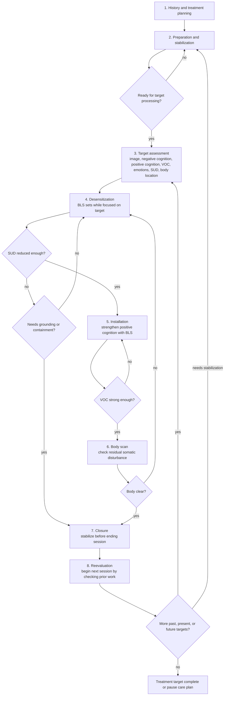
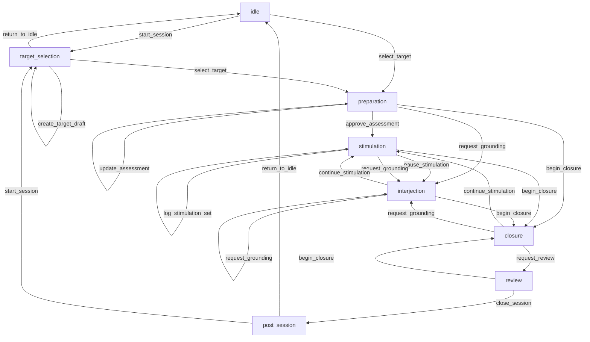
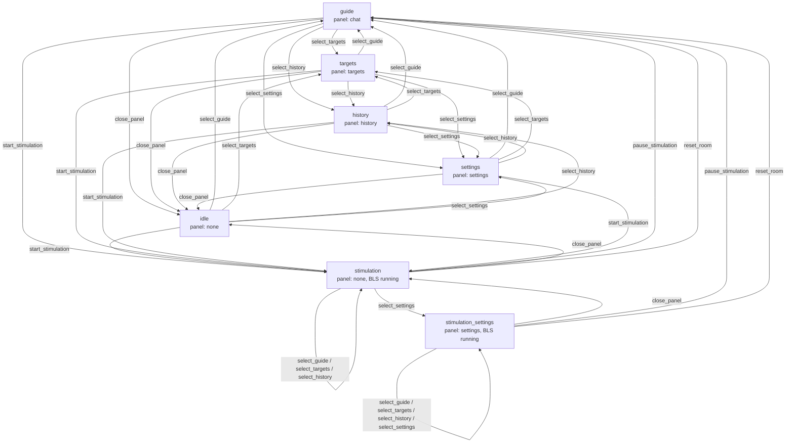

# Feature: EMDR Flow Comparison

## Status

Research and state inventory only. No implementation decision is made here.

## Scope

This document compares a research-backed EMDR therapy flow against the current
app state graphs so product and clinical decisions can be made explicitly before
code changes.

Important constraint: the research sources describe clinician-delivered EMDR.
They do not, by themselves, authorize an unsupervised desktop app to claim that
it provides EMDR therapy. Future workflow changes that make clinical claims
should follow [ADR 0001](../adr/0001-clinical-evidence-policy.md).

No database schema or endpoint schema changes are proposed in this document.

## Sources Reviewed

- EMDRIA, "The Eight Phases of EMDR Therapy":
  https://www.emdria.org/blog/the-eight-phases-of-emdr-therapy/
- EMDRIA, "EMDRIA Definition of EMDR":
  https://www.emdria.org/wp-content/uploads/2020/04/EMDRIADefinitionofEMDR.pdf
- VA National Center for PTSD, "Eye Movement Desensitization and Reprocessing
  for PTSD": https://www.ptsd.va.gov/professional/treat/txessentials/emdr_pro.asp
- NICE NG116 PTSD recommendations:
  https://www.nice.org.uk/guidance/ng116/chapter/Recommendations

The sources are consistent on the core structure: EMDR is phased, preparation
and stabilization happen before target processing, target assessment captures
image/cognition/SUD/VOC/body data, bilateral stimulation happens in sets with
periodic review, closure happens at the end of processing sessions whether or
not processing is complete, and reevaluation starts later sessions.

## Researched EMDR Flow

## Current Session Flow

Source of truth: [flow.ts](../../src/main/internal/domain/session/flow.ts).

Current persistence recovery also matters: an unfinished session with no logged
sets is recovered into `preparation`; an unfinished session with any logged set
is recovered into `interjection`. More specific clinical phase position is not
durable today.

## Current Animated Room States

Source of truth:
[animatedRoomMachine.ts](../../src/renderer/app/animatedRoomMachine.ts).
This chart reflects reducer semantics. Some events are only dispatched from
specific UI controls.

While stimulation is running, selecting guide, targets, or history leaves the
room in the running state. Selecting settings moves to `stimulation_settings`.
The reducer also treats `reset_room`, `start_stimulation`, and
`pause_stimulation` as global events, regardless of the current state.

## Current-To-Research Mapping

| Research phase | Current support | Gap |
| --- | --- | --- |
| History and treatment planning | Targets can be created and selected. | No explicit history, readiness, treatment-plan, risk, or clinician-supervision gate. |
| Preparation and stabilization | `preparation`; `request_grounding`; guide chat can propose actions. | Preparation is not distinct from assessment, readiness is not modeled, and stabilization resources are not first-class. |
| Target assessment | `AssessmentForm` captures image, negative cognition, positive cognition, VOC, emotions, SUD, and body location. | Assessment can be approved without documented readiness criteria, and "Start Set" can implicitly approve assessment. |
| Desensitization | `stimulation`, `log_stimulation_set`, `pause_stimulation`, `interjection`. | No separate desensitization phase, SUD threshold, blocked/complete target decision, or between-set clinical decision model. |
| Installation | Not distinct. | Positive cognition strengthening is not modeled separately from stimulation. |
| Body scan | Initial body location is captured in assessment. | No post-installation body scan state or residual-disturbance loop. |
| Closure | `closure`, `request_review`, and session end from `review`. | Closure is optional until the user or guide chooses it; no enforced closure after activated material or before ending app work. |
| Reevaluation | `review` and `post_session` exist. | `review` is current-session closeout, not phase 8 reevaluation at the next session start. |
| Three-pronged protocol | Targets can recur across sessions. | Past events, present triggers, and future templates are not represented as target categories or progression. |

## Likely Change Areas

These are candidates for product and clinical review, not implementation tasks
yet:

- Split `preparation` into explicit preparation/readiness and target assessment
  states, or keep one state but add a documented readiness gate before
  `approve_assessment`.
- Split broad `stimulation` into desensitization, installation, and body-scan
  states if the product intends to model the standard protocol instead of a
  simpler EMDR-informed set tracker.
- Require closure after processing has started before a session can be closed
  or abandoned.
- Recast `review` as current-session summary and add a separate next-session
  `reevaluation` step before returning to target assessment or preparation.
- Decide whether targets need protocol prongs: past memory, present trigger,
  future template. This may require schema changes and must not be implemented
  without explicit approval.
- Make room state orthogonal as already noted in
  [state-graph-simplification.md](state-graph-simplification.md): panel state
  and stimulation running state should be separate facts.
- Decide whether workflow phase should be durable. Current recovery collapses
  active sessions into `preparation` or `interjection`, which may be too coarse
  if more clinical phases are added.

## Open Questions

- Is the app trying to implement a clinical EMDR protocol, or an EMDR-informed
  local support tool with explicit non-clinical limits?
- Should a user be able to start BLS from `preparation`, or should BLS require a
  completed target assessment and an explicit readiness confirmation?
- Should the app support incomplete processing between sessions as a first-class
  state, including next-session reevaluation?
- Should future implementation require clinician mode, supervision language, or
  stronger safety gates before protocol-like flows are exposed?
